# Crypto Trading Algorythm

Bit‐coin is the original and most repitable cryptocurrency in the world. One big flaw in cryptocurrency trading is the volatility of the crypto marketplace. Cyrptocurrencies trade on a 24 hour, 7 day a week clock, tracking cryptocurrency positions against rapidly changing market dynamics is an impossible task to manage. This is where automated trading algorithms and trading bots can assist.

## Background

Our goal is to predict the best market move with either a buy or sell signal. To do this we'll build a trading strategy with a defined classification framework, where the predicted variable has a value of 1 for buy and 0 for sell. This signal is determined by comparing the short-term and long-term price trends.

We use data from the CBSE bitcoin exchange in terms of the volume-weighted average price (VWAP) which is a technical analysis indicator used on intraday charts that resets at the start of every new trading session. It's a trading benchmark that represents the average price a security has traded at throughout the day, based on both volume and price. VWAP is important because it provides traders with pricing insight into both the trend and value of a security. This data is pulled via an Alpaca API and the data covers prices from Oct 2016 to current day. Different trend and momentum indicators are created from the data and are added as features to enhance the performance of the prediction model.

## What We're Creating
Machine learning's key aspect is called feature engineering. Feature engineering is when we create new, intuitive features based on our data and feed them to a machine learning algorithm in order to improve the predictions. We will introduce different technical indicators as features to help predict future prices, higher or lower than the current price, of an asset. Technical indicators are derived from market variables which in turn provide deeper insight into our buy and sell signals.  There are many different categories of technical indicators, including trend, volume, volatility, and momentum indicators.

In this project, we use various classification based prediction models to predict whether the current position signal is buy or sell. We will create additional trend and momentum indicators from market prices to leverage as additional features in our prediction model.

This project will focus on:
- Building a trading strategy using classification (classification of long/short signals).
- Feature engineering and constructing technical indicators of trend, momentum, and mean reversion.
- Build a framework for backtesting our crypto trading strategy.
- Choosing the right evaluation metric to assess our trading strategy.

### loading the packages and the data.

#### Load Python packages.
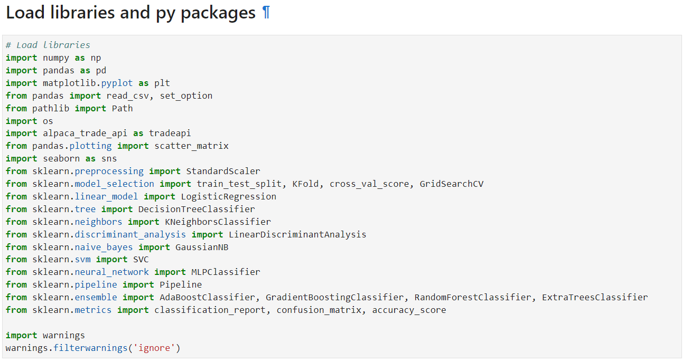
#### Loading our API dataset
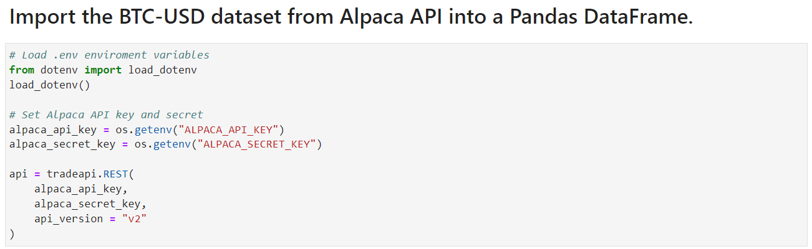
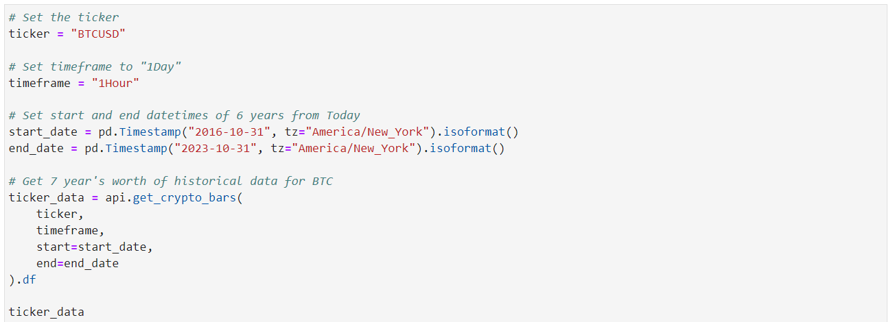

#### Data Prep and Cleaning

#### Generate trading signals using short and long window SMA values
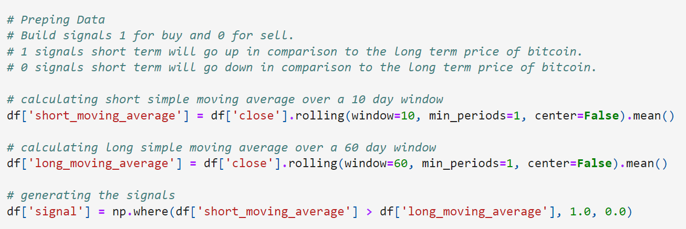

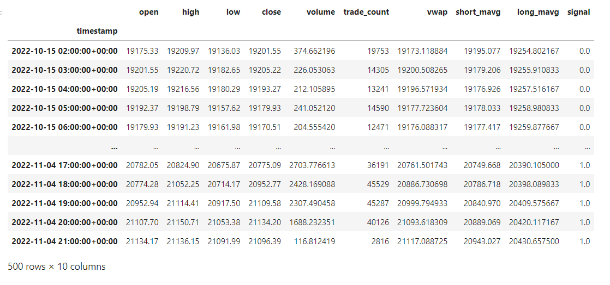

#### Feature Engineering
Feature engineering is the ‘art’ of formulating useful features from existing data following the target to be learned and the machine learning model used. It involves transforming data to forms that better relate to the underlying target to be learned. We begin by analyzing the features that we expect may influence the performance of our prediction model. Based on a conceptual understanding of key factors that drive investment strategies, the task at hand is to identify and construct new features that may capture the risks or characteristics embodied by these return drivers.

The current dataset of the bitcoin (BTC) consists of timestamp, open, high, low, close, volume, trade count and vwap. Using this data, we calculate the following momentum indicators.

We perform feature engineering to construct technical indicators which will be used to make the predictions, and the output variable.

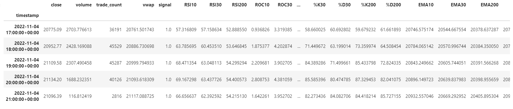

##### Relative Strength Index(RSI):
Is a momentum indicator that measures the magnitude of recent price changes to evaluate overbought or oversold conditions in the price of a stock or other asset.

The RSI is calculated using the following formula: RSI = 100 – (100 / [1 + RSI]), where RSI equals the average gains of up periods during the specified period divided by the average losses of down periods during the specified period.

When using the RSI, traders look for the following:

- Buying opportunities at oversold positions (when the RSI value is 30 and below)
- Buying opportunities in a bullish trend (when the RSi is above 50 but below 70)
- Buying opportunities during a bullish reversal (in a bullish divergence)
- Selling opportunities at overbought positions (when the RSI value is 70 and above)
- Selling opportunities in a bearish trend (when the RSI value is below 50 but above 30)
- Selling opportunities during a bearish reversal (in a bearish divergence)

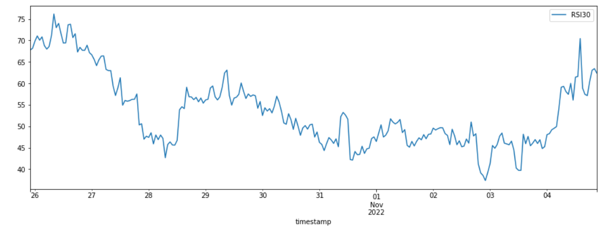

##### Rate Of Change(ROC):
It is a momentum oscillator, which measures the percentage change between the current price with respect to an earlier closing price n periods ago.

How this indicator works

- An upward surge in the Rate-of-Change reflects a sharp price advance. A downward plunge indicates a steep price decline.
- In general, prices are rising as long as the Rate-of-Change remains positive. Conversely, prices are falling when the Rate-of-Change is negative.
- ROC expands into positive territory as an advance accelerates. ROC moves deeper into negative territory as a decline accelerates. 

Calculation: ROC = [(Today’s Closing Price – Closing Price n periods ago) / Closing Price n periods ago] x 100

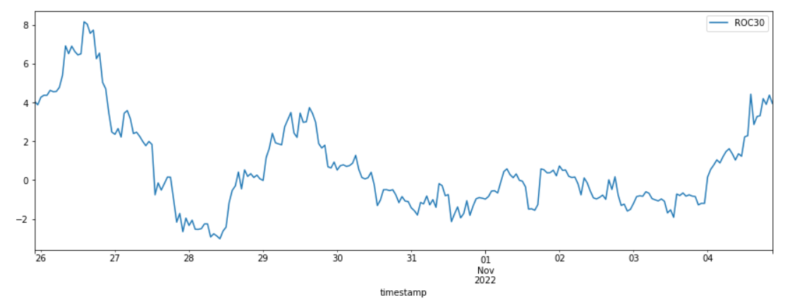

##### Momentum (MOM):
The Momentum Oscillator measures the amount that a security’s price has changed over a given period of time. The Momentum Oscillator is the current price divided by the price of a previous period, and the quotient is multiplied by 100. The result is an indicator that oscillates around 100. Values less than 100 indicate negative momentum, or decreasing price, and vice versa.

Calculation: Momentum Oscillator = (Price today / Price n periods ago) x 100

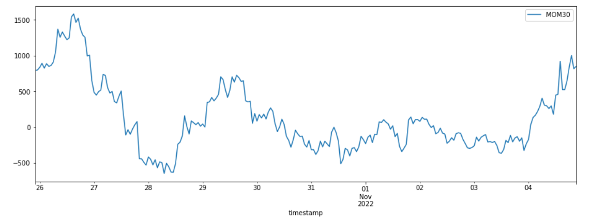

##### Stochastic Oscillator %K and %D:
A stochastic oscillator is a momentum indicator comparing a particular closing price of a security to a range of its prices over a certain period of time. The sensitivity of the oscillator to market movements is reducible by adjusting that time period or by taking a moving average of the result.

Stochastic oscillators measure recent prices on a scale of 0 to 100, with measurements above 80 indicating that an asset is overbought and measurements below 20 indicating that it is oversold.

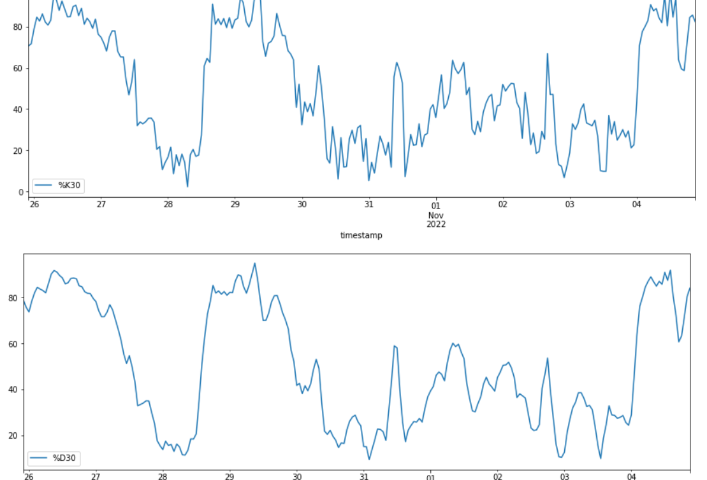

##### Exponential Moving Average (EMA)
Exponential Moving Average (EMA) is similar to Simple Moving Average (SMA), measuring trend direction over a period of time. However, whereas SMA simply calculates an average of price data, EMA applies more weight to data that is more current. Because of its unique calculation, EMA will follow prices more closely than a corresponding SMA.

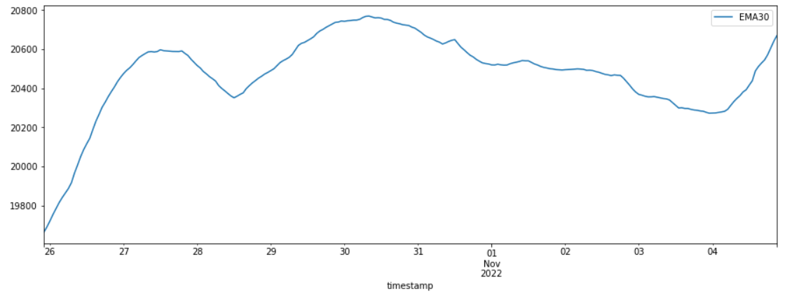

##### Moving Average:
A moving average provides an indication of the trend of the price movement by cut down the amount of "noise" on a price chart.

- The moving average helps to level the price data over a specified period by creating a constantly updated average price.
- A simple moving average (SMA) is a calculation that takes the arithmetic mean of a given set of prices over a specific number of days in the past.

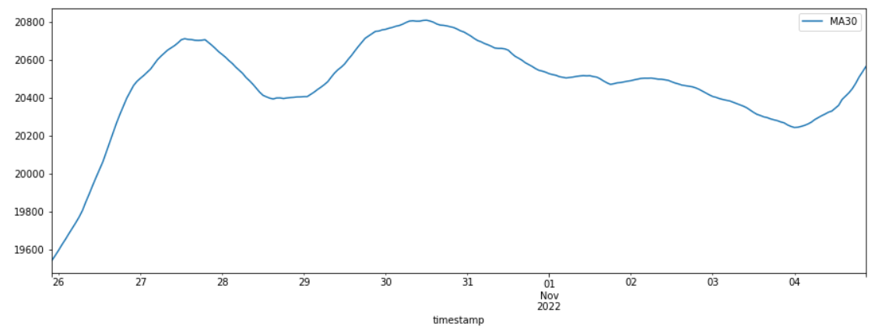

#### Data Vizualization
Visualize different properties of the features and the predicted variable

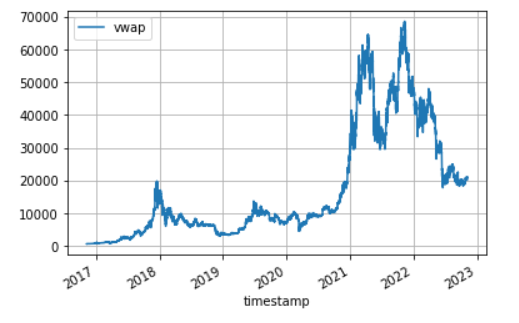

The chart illustrates a sharp rise in the price of bitcoin to a steep drop, increasing from under 1000 to a high of almost $70,000 at the end of 2021. Also, high price volatility is readily visible.

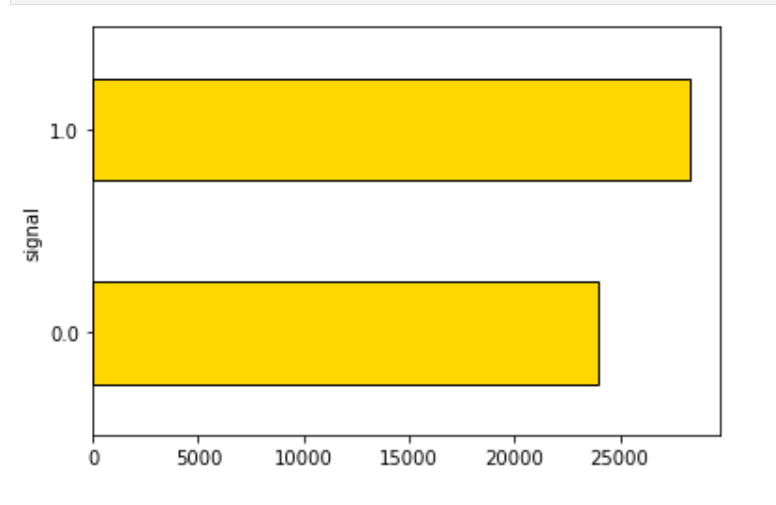

The predicted variable signal shows us the amount of times a signal is either a BUY or SELL, the predicted variable is relatively balanced however.

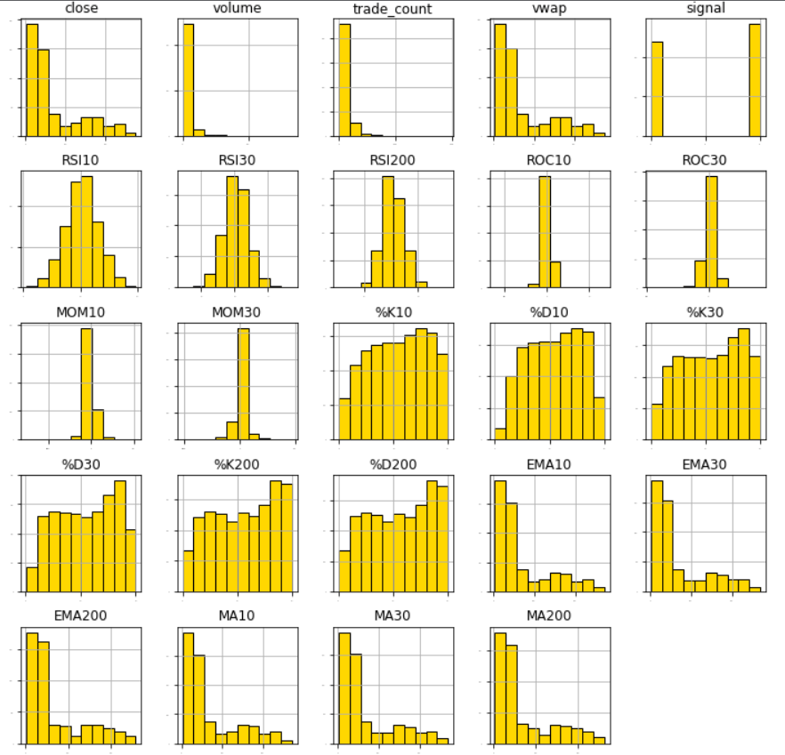

This histogram summarize discrete or continuous data that are measured on an interval scale. It is often used to illustrate the major features of the distribution of the data in a convenient form.

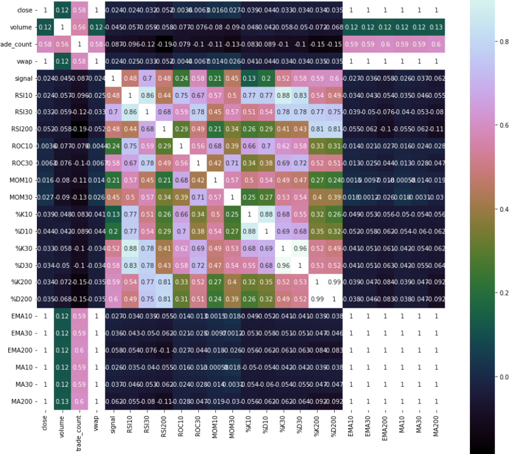

This correlation matrix is a table showing correlation coefficients between variables. Each cell in the table shows the correlation between two variables.

#### Train Test Split our data
Split the dataset into 80% training set and 20% test set.

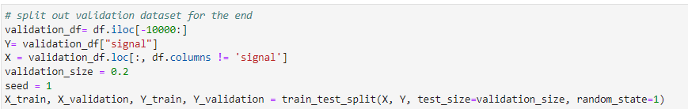

#### Algo and Model Comparisons
In order to know which algorithm is best for our strategy, we evaluate the linear, nonlinear, and ensemble models.

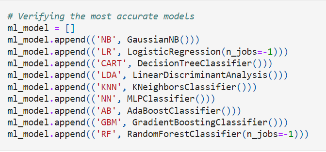

#### K-folds cross validation
Helps us to avoid overfitting. As we know when a model is trained using all of the data in a single short and give the best performance accuracy. To resist this k-fold cross-validation helps us to build the model is a generalized one

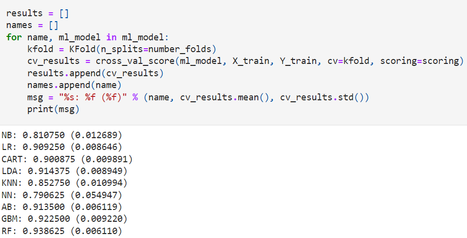

#### Vizualize and Compare algorithms

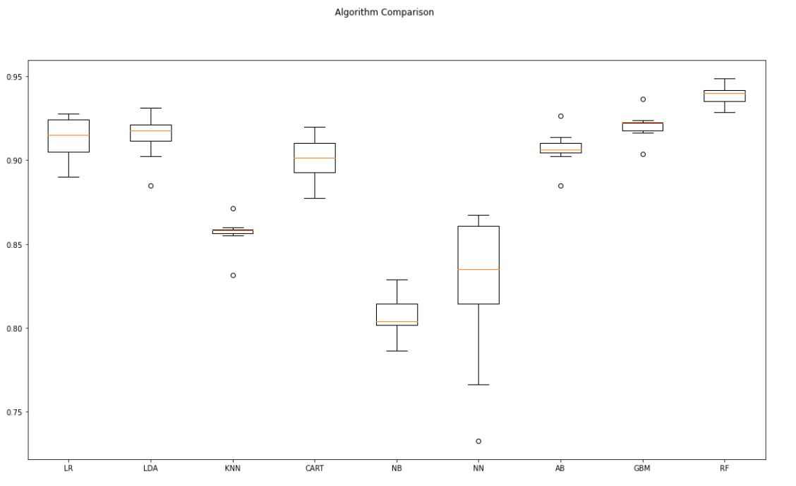

After performing the k-fold cross validation, the Alogorithm comp chart illustrates the comparison of the models

#### Model Tuning
Although some of the models show promising results, we prefer an ensemble model given the size of the dataset, the large number of features, and an expected non‐linear relationship between the predicted variable and the features. Random forest has the best performance among the ensemble models

Random Forests are often used for feature selection in a data science workflow. The reason is because the tree-based strategies used by random forests naturally ranks by how well they improve the purity of the node. This mean decrease in impurity over all trees (called gini impurity).

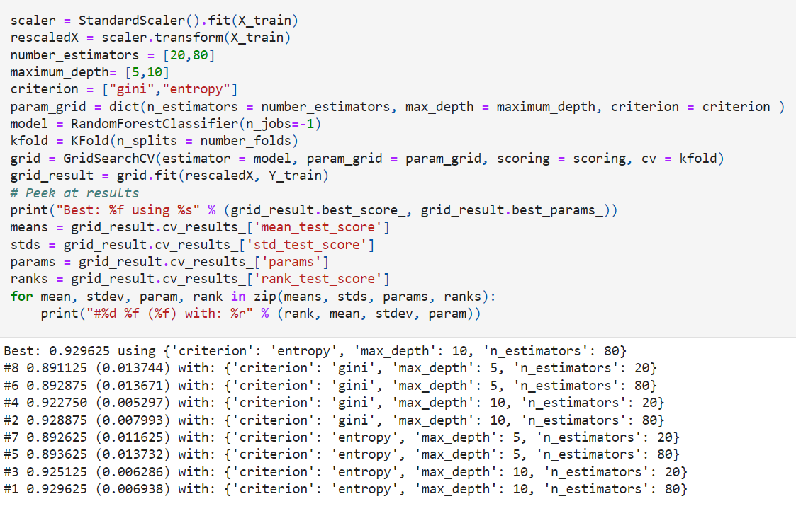

### Finalize the Model
Finalizing the model with best parameters found during tuning step.

#### Test Dataset results

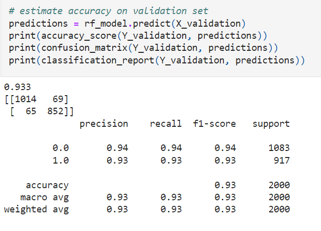

The selected model performs quite well, with a high accuracy.

- Precision: Percentage of correct positive predictions relative to total positive predictions.
- Recall: Percentage of correct positive predictions relative to total actual positives.
- F1 Score: A weighted harmonic mean of precision and recall. The closer to 1, the better the model.

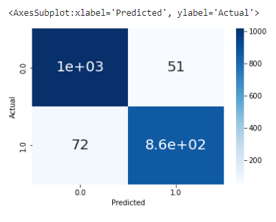

The overall model performance is reasonable and is in line with the training set results
Here we see the true positive, true negative, false positive and false negative values mean.

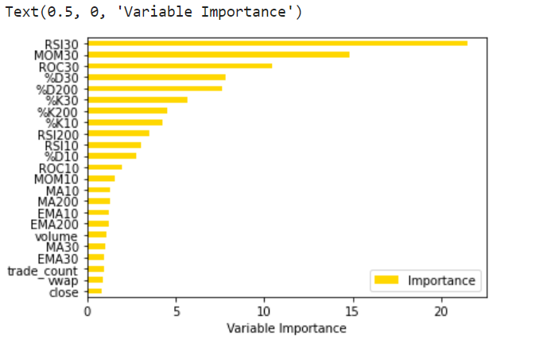

The result of the variable importance looks intuitive, and the momentum indicators of RSI, MOM and ROC over the last 30 days seem to be the three most important features. The feature importance chart corroborates the fact that introducing new features leads to an improvement in the model performance.

### Backtesting
We perform a backtest on the model we’ve developed by creating a column for our daily returns and multiplying it by the strategy returns in relation to the position that was held at the close of business the previous day and then we compare it to the the actual returns.

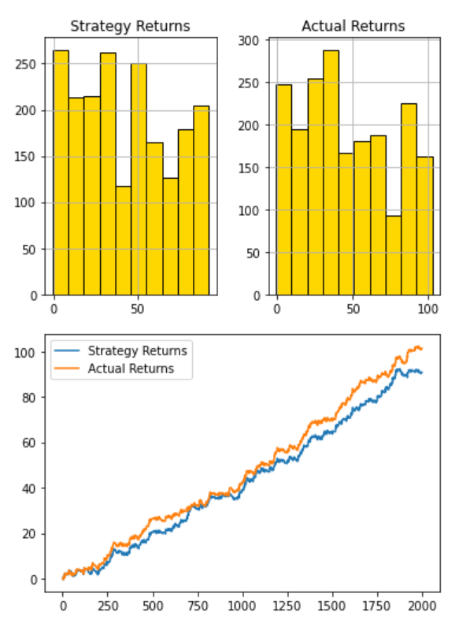

When we look at our backtesting results, we can see that there is not much deviation from the actual market return. we can conclude that our momentum trading strategy in fact made us better at predicting the price direction to either sell or buy in order to achieve profits. We also made only a few losses in comparison to the actual returns.

### Buy or Sell
Algo model recommendations for the past 24 hours.

### Our Conclusions (Part 1)
One of the most significant steps in order to solve any problem, especially the hard and challenging ones, lies in finding a proper strategic approach and securing a complete understanding of the problem that we are trying to solve. A proper strategy approach should answer questions such as: should we have to predict prices, price movement direction, price trends, price spikes and so on.  

Next, we apply data preprocessing and feature engineering strategies and outline that feature engineering is an effective method for the creation of intuitive features related to momentum and trend indicators of Bitcoin’s price movement and increases the accuracy of our models predictions. 

In terms of the evaluation metrics for a classification-based trading strategy, accuracy is appropriate. However, in case the strategy is focusing to be more accurate while going long, the metric recall that focuses on less false positives can be preferred as compared to accuracy. 

Then we demonstrated our back testing framework which allowed us to simulate a crypto trading strategy by using historical data to generate results and analyze risk and profitability before risking any actual capital. 

Finally, we print out a Buy or Sell slip covering the previous 24 hour period with 1 representing a BUY recommendation and a 0 representing a SELL recommendation.

### Optional: Dimensionality Reduction (Part 2)

Dimensionality reduction is used to allow end users to interpret large dataframes with complex information and relationships between that information into lower dimension datasets that still inherit the meaningful purpose of the larger more complex dataframe.  Dimensionality reduction is helpful with large datasets because the raw data is often missing lot of data points.  We are going to use dimensionality reduction to eliminate noise from our data and visualize the the data in a clustered format (our buy and sell signals). 

#### Singular Value Decomposition (SVD) 

SVD is a linear dimensionality reduction technique that reduces the number of input variables that are sent to the predictive model.  By reducing the number of input we hope that our model will in turn have better performance in terms of speed without reducing the accuracy of the predictions.  By reducing the number of inputs into the model we also eliminate data that may not truely be representative of the full dataset.

We start be determining the most important features of our model and find that the top five features of our model account for approximately 93% of the variance within our dataset.  

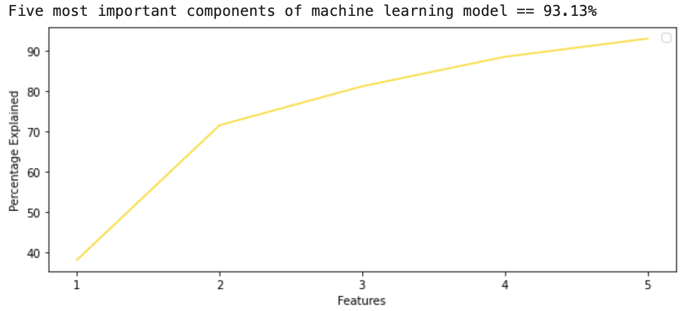

We then compare those top five features visually against each other with our buy/sell signals using pair plots.  By doing this we can see that even after our data has been reduced we have very clustered data which helps us confirm that the reduction in our model is still outputting similar information as the non reduced data. 

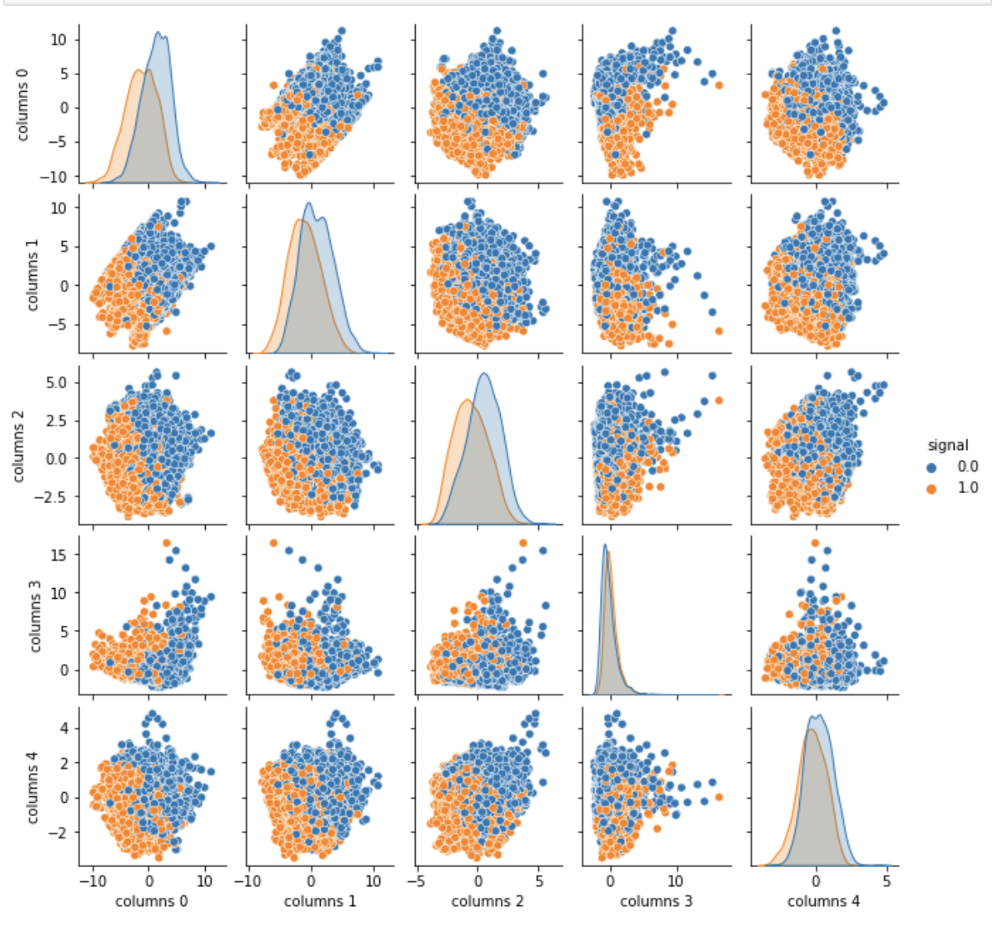

We also built a 3-D outline of our data comparing the first three components and clustering our buy/sell signals. 

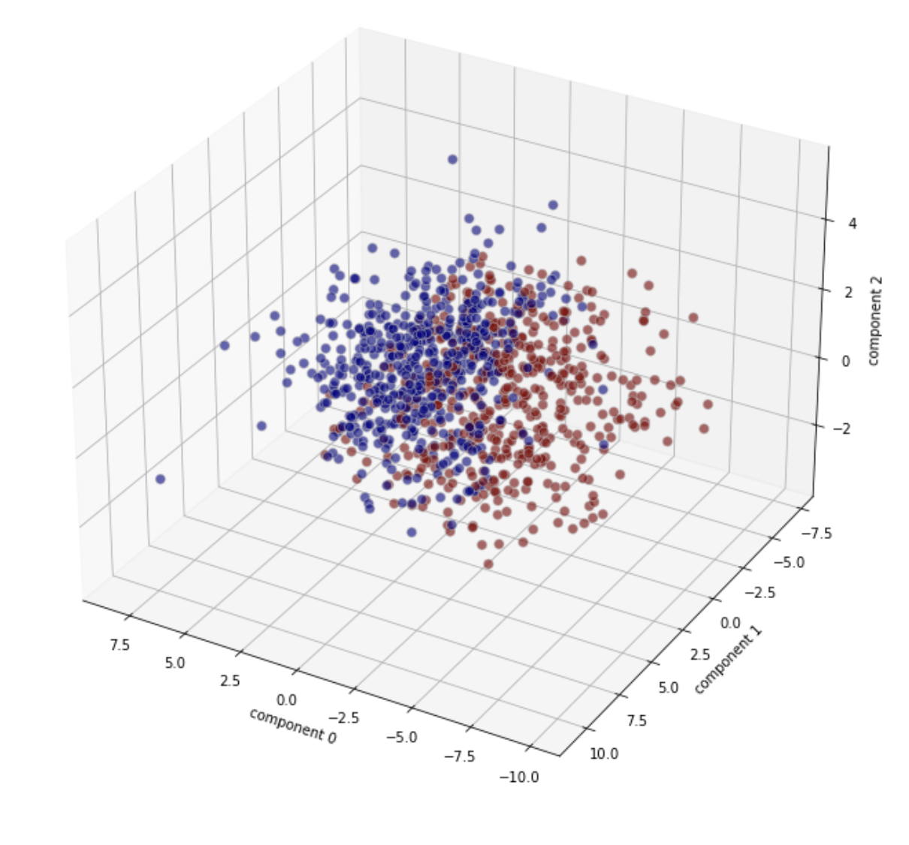

#### t-SNE 

t-SNE is a nonlinear dimensionality reduction technique that is well suited to reduce high dimensionality data to low dimensionality data without losing the essence of what that data is. t-SNE takes the data inputs, finds the relationship each data point has with all the other data points, finds clusters of that data and then puts that data on a lower dimension scale, we are going from 3-D data into 2-D data in this project. 

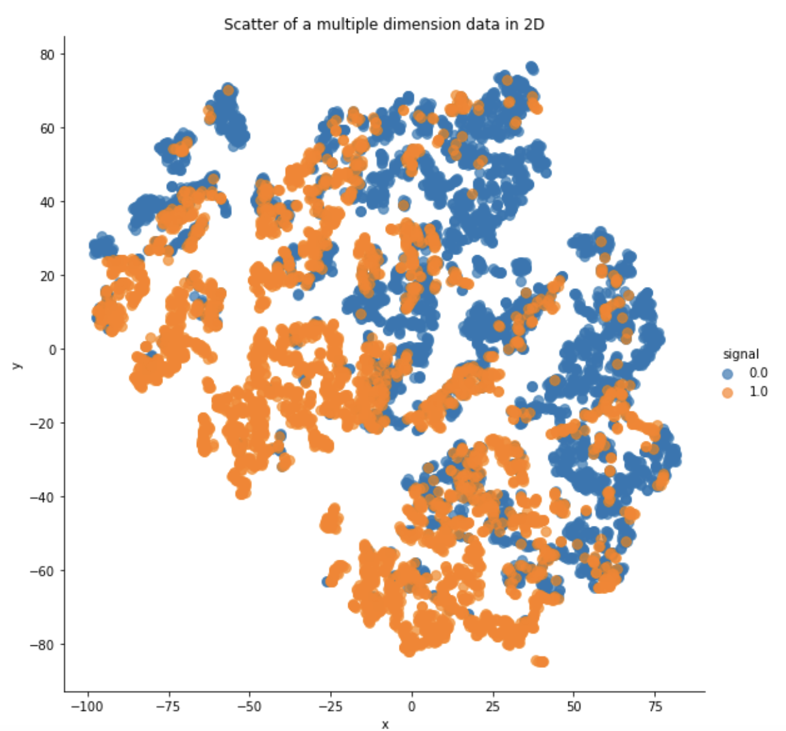

#### Conclusion

We found that by reducing our data through the SVD reduction model we were able reduce the processing time of our algorith by approximately 45%, while only reducing the accuracy by around 4%.  Because the model is so much faster with the dimensionality reduction while only being slightly less accurate, we determined it would be best to use the reduced dataset when running our model moving forward as when making trades in this type of environment with bots speed is extremely important.  
